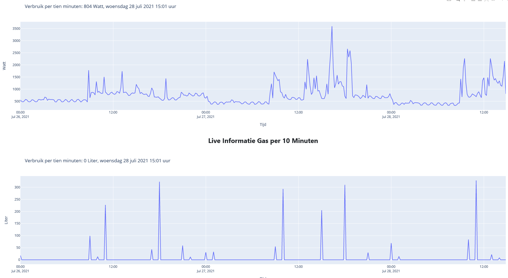

# WORK IN PROGRESS
This project is still in development.

# Youless-LS120 v0.5.0
For version information check the [CHANGELOG.md](CHANGELOG.md "CHANGELOG.md")

## Package
This package is for importing data from a YouLess LS120 datalogger that is connected to a smart electricity and gas meter.
The data is stored in an SQLite3 database and displayed on a dash webpage using pandas and plotly.
I created this package for stand-alone usage and not with a setup.py for installing.
While I oriented this on Dash it is ofcourse possible to use the data retrieved from the YouLess and the plotly figures created in any other webpage.

## Functions:
- Dash text is available in Dutch and English (change in [settings.py](LS120/settings.py "settings.py"))
- Realtime live view with about 2 minutes history, updates every 5 seconds (showed data comes directly from the youless and is not stored in the database)
- Live view per minute up to 10 hours history, updates every minute (showed data comes directly from the youless and is not stored in the database)
- Live view per ten minutes up to 10 days history (example shows only 2 days), updates every ten minutes (showed data comes directly from the youless and is stored separately in database)
- History view for Electricity and Gas:
	- Today and yesterday per hour
	- This month and last month per day
	- This year and last year per month
	- This year and last year per day
- Import and process Energy (Electricity and Gas) data from Youless LS120 into SQLite3 database
	- All data is stored as text and converted when read from the database
	- Data is stored in 6 separate tables, 3 per type (Electricity or Gas)
	- *Appends and overwrites data if needed*
- Read data back from SQLite3 database
- Convert read data to list based on wanted items
- Convert list to Pandas DataFrame based on wanted items
- Create dash based website with graphs (used as example)

## Usage:
- git clone the repository
	```
	git clone https://github.com/LouDnl/Youless-LS120.git
	cd Youless-LS120
	```
- install all the requirements from [requirements.txt](requirements.txt "requirements.txt") \
	`python3 -m pip install -r requirements.txt` \
	requirements.txt is created with [pipreqs](https://pypi.org/project/pipreqs/ "https://pypi.org/project/pipreqs/")
- Run either example files to get an idea of what is possible. \
	- `python3 dash_allgraphs_live.py default` runs dash_allgraphs_live with settings from dash_settings.py: \
	- `python3 dash_allgraphs_live.py IP PORT DEBUG` runs dash_allgraphs_live with provided settings where: \
	IP = the ip to host dash on \
	PORT = the port to host dash on \
	DEBUG = either True or False to see Dash errors and callbacks \
	example: `python3 dash_allgraphs_live.py 192.168.1.100 8080 False` \
	- `python3 dash_test_view.py` runss dash_test_view with settings from dash_settings.py
- Or use any of the package funtions in your own code. Every function \
	has it's own description, go check them out in the [Package files description](docs/package.md "Package files description")

## Example files:
- dash_allgraphs_live.py starts a flask webserver that displays all available graphs
	- updates the database on start and while active
	- plots live, daily, monthly and yearly Electricity and GAS usage
	- webpage is hosted on ip that is set in dash_settings.py and based on debug setting \
	or the webpage is hosted on settings given as command line arguments and ignores dash_settings.py.
- dash_test_view.py starts a flask webserver that displays the graphs set in that same file under the callback and multi_output function
	- this file is for testing purposes
	- webpage is hosted on ip that is set in dash_settings.py and based on debug setting
- dash_settings.py contains the IP, debug and reloader settings for the dash webserver.
- dash_web_elements.py contains pre defined settings for both example files \
 they can also be used for your own dash page.
- **when running default and if DASH_DEBUG in dash_settings.py is set to True the webserver will be hosted on local_ip,** \
**if set to False the webserver will be hosted on remote_ip**

## Package files:
- Per file explanation in: \
[Package files description](docs/package.md "Package files description")

## Run as service on linux
- Instructions in [Systemd service on linux](docs/startupscript.md "Linux service instructions")
- This uses environment variables as settings and omits any settings from the python scripts

## Unittesting:
- All functions can be tested with unittests found in [test](tests "tests")
- To run all tests:
	```
	git clone https://github.com/LouDnl/Youless-LS120.git
	cd Youless-LS120
	python3 -m LS120.db_create
	python3 -m tests.test
	```

## Formatting and Docstrings
- File formatting and docstrings as per [PEP8](https://www.python.org/dev/peps/pep-0008/#module-level-dunder-names "https://www.python.org/dev/peps/pep-0008/#module-level-dunder-names") and [PEP257](https://www.python.org/dev/peps/pep-0257/ "PEP257")
- All files are checked with [Flake8](https://pypi.org/project/flake8/ "https://pypi.org/project/flake8/")

## To Do:
- Convert read database data to Pandas DataFrame directly
- Create interactive Dash website with:
	- Separate webpage from plot script
	- Automatic view of available data
	- Buttons that click to available data
	- Custom graphs based on available data. e.g. average electricity usage on wednesdays
- Add option to use package with setup.py
- ~~Add possibility for users to configure settings.py~~
- ~~Add live per ten minute function~~
- ~~Add quick tutorial to create a linux service that always runs~~
	- ~~Examples available in docs/startupscript.txt (No explanation yet)~~
- ~~Split import_data into read and return and write to database~~
- ~~Add explanatory usage per package file method~~
- ~~Add extra notations for more clarity~~
- ~~Remove commented out code~~
- ~~Add quick tutorial on how to install requirements.txt~~
- ~~Live usage view~~
- ~~Combine reused code to importable class methods~~
- ~~Add GAS usage~~
- ~~Check if existing data in database matches retrieved data from Youless, if so then do nothing, else append~~
- ~~Create automatic readout from LS120~~
- ~~Make webpage available on linux server~~


## Some example views
\
\
\
\
\
\

