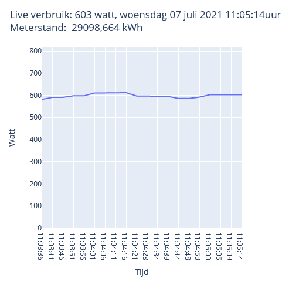
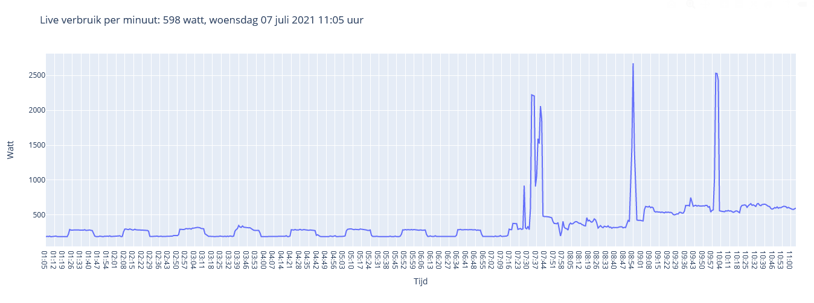
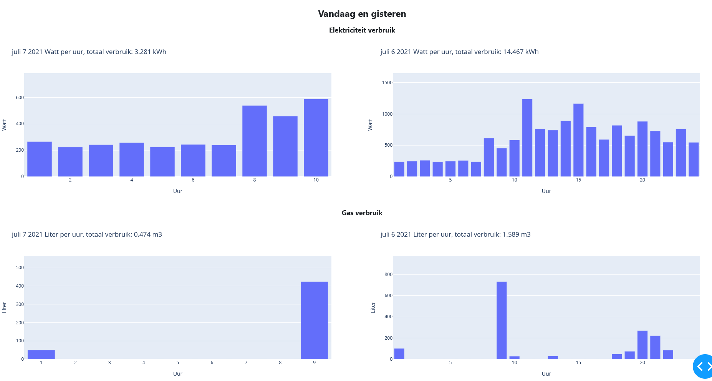
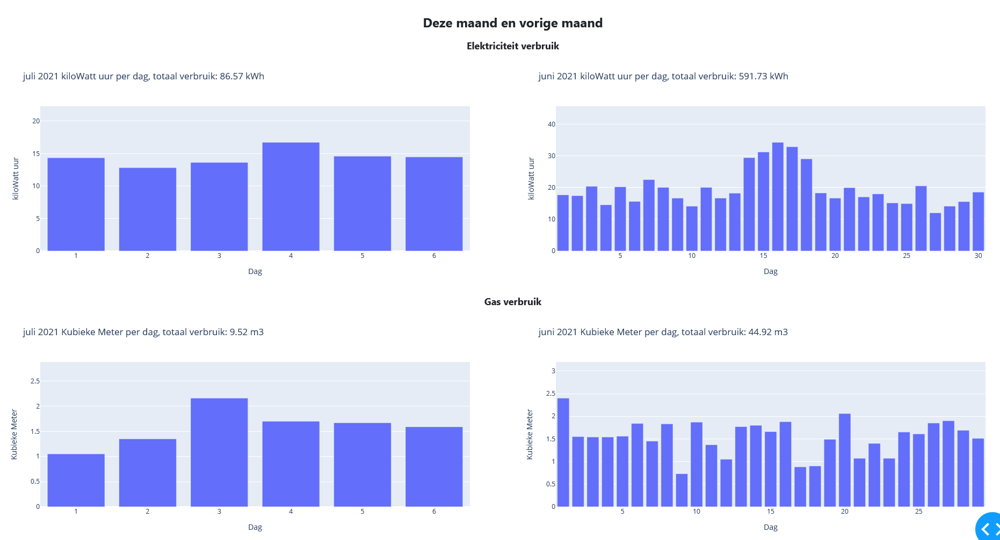
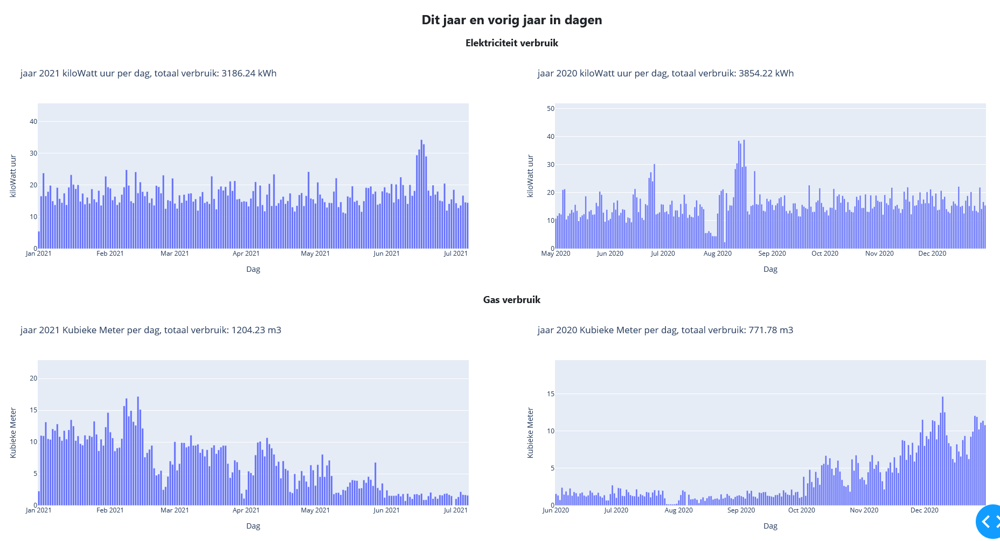
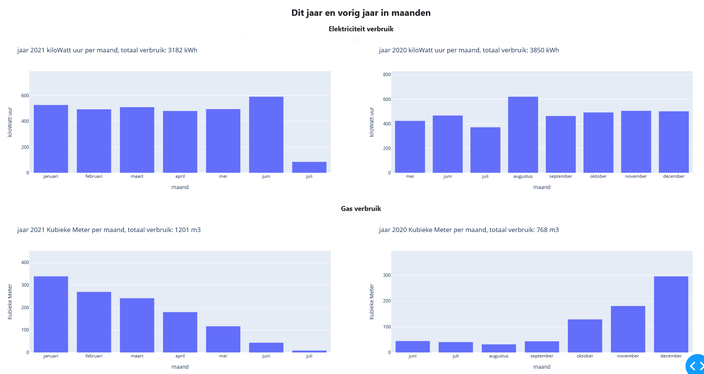

# WORK IN PROGRESS
This project is still in development. \
The files are still full of debug logs and commented out test code.

# Youless-LS120

## Functions:
 - Dash text is available in Dutch and English (setting in globals.py)
 - Realtime view with about 2 minutes history, updates every 5 seconds (not stored in database)
 - Live view per minute up to 10 hours history, updates every minute (not stored in database)
 - Import and process Energy (Electricity and Gas) data from Youless LS120 into SQLite3 database 
	- All data is stored as text and converted when read from the database
	- *Appends and overwrites data if needed*
 - Read data back from SQLite3 database
 - Convert read data to list based on wanted items
 - Convert list to Pandas DataFrame based on wanted items
 - Create dash based website with graphs
 
 ## Files:
 - liveview_allgraphs.py plots live, daily, monthly and yearly Electricity and GAS usage and automatically updates the database
	- this file is to show all graphs as an example and is provided as is
	- webpage is hosted on ip that is set in globals.py and based on debug setting
 - testView.py plots graphs that are set under the callback and multi_output function. This file is for testing graphs
	- this file is for testing purposes
	- webpage is hosted on ip that is set in globals.py and based on debug setting
 - globals.py contains all settings, no need to edit the other files
 - webElements.py contains pre defined settings for both view files
 - createDatabase.py creates youless.db if needed or appends tables if needed
 - importData.py reads static data from Youless LS120 and writes it to the database
 - readData.py reads data from the database and returns lists with data
 - plotData.py converts lists with data and returns plotly figures 
 - readLive.py reads live data fro the Youless LS120 and returns lists with data
 - plotLive.py converts lists with live data and returns plotly figures

## requirements.txt
 - Contains all needed libraries/modules
 - Install them with: python -m pip install -r requirements.txt

## To Do:
 - Create interactive Dash website with:
	- Separate webpage from plot script
	- Automatic view of available data
	- Buttons that click to available data
	- Custom graphs based on available data. e.g. average electricity usage on wednesdays
 - Add quick tutorial to create a linux service that always runs
	- Examples available in startupscript.txt (No explanation yet)
 - Add extra notations for more clarity
 - Remove commented out code
 - Convert read database data to Pandas DataFrame directly
 - ~~Add quick tutorial on how to install requirements.txt~~
 - ~~Live usage view~~
 - ~~Combine reused code to importable class methods~~
 - ~~Add GAS usage~~
 - ~~Check if existing data in database matches retrieved data from Youless, if so then do nothing, else append~~
 - ~~Create automatic readout from LS120~~
 - ~~Make webpage available on linux server~~
 
 
## Some example views
\
\
\
\
\

