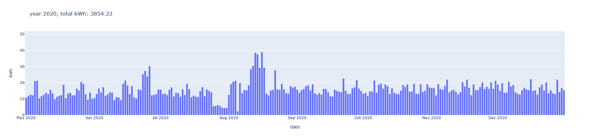
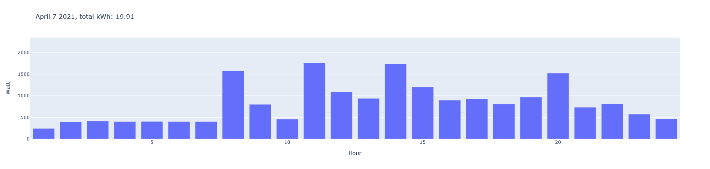

## WORK IN PROGRESS
I am still developing this script. \
Shown here is only the current version for backup. \
The scripts are still full of debug logs and commented out test code.

## Youless-LS120

# Functions:
 - Import and process Energy data from Youless LS120 into SQLite3 database 
	- Data is stored as text
	- *overwrites existing data but appends new data*
 - Read data from SQLite3 database
 - Convert read data to list based on wanted items
 - Convert list to Pandas DataFrame based on wanted items
 - Plot DataFrame with plotly to webpage with Dash
	- Shown data is fixed to what is asked for in plotEnergy.py > dashtest()
	- webpage is only locally available to where the script is executed

# To Do:
 - Add extra notations for more clarity
 - Add GAS usage
 - Check if existing data in database matches retrieved data from Youless, if so then do nothing, else append
 - Convert read database data to Pandas DataFrame directly
 - Create automatic readout from LS120
 - Deparate webpage from plot script
 - Make webpage available on linux server
 - Create interactive Dash website with:
	- Automatic view of available data
	- Buttons that click to available data
	- Live usage view
 - Tidy up files
 
# Some example views
\
\ 