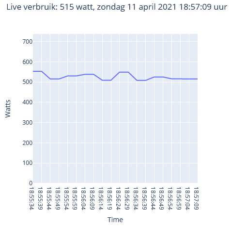
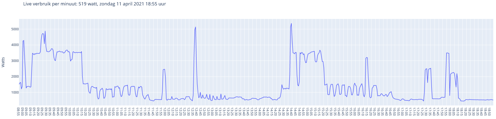

# WORK IN PROGRESS
This project is still in development. \
The files are still full of debug logs and commented out test code.

# Youless-LS120

## Functions:
 - Realtime view with about 2 minutes history
 - Live view per minute up to 10 hours history
 - Import and process Energy (Electricity and Gas) data from Youless LS120 into SQLite3 database 
	- All data is stored as text and converted when read from the database
	- *Appends and overwrites data if needed*
 - Read data from SQLite3 database
 - Convert read data to list based on wanted items
 - Convert list to Pandas DataFrame based on wanted items
 - Liveview.py plots live, daily, monthly and yearly Electricity and GAS usage and automatically updates the database
   - webpage is available to what is set in globals.py
 - Plot DataFrame with plotly to webpage with Dash
	- Shown data is fixed to what is asked for in plotEnergy.py > dashtest()
	- webpage is only locally available to where the script is executed
 - globals.py contains all settings, no need to edit the other files

## requirements.txt
 - Contains all needed libraries/modules

## To Do:
 - Add extra notations for more clarity
 - Remove commented out code
 - Combine reused code to functions
 - Convert read database data to Pandas DataFrame directly
 - Add quick tutorial to create a linux service that always runs
 - Add quick tutorial on how to install requirements.txt
 - Create interactive Dash website with:
	- Separate webpage from plot script
	- Automatic view of available data
	- Buttons that click to available data
	- ~~Live usage view~~
 - ~~Add GAS usage~~
 - ~~Check if existing data in database matches retrieved data from Youless, if so then do nothing, else append~~
 - ~~Create automatic readout from LS120~~
 - ~~Make webpage available on linux server~~
 
 
## Some example views
\
\
\
 